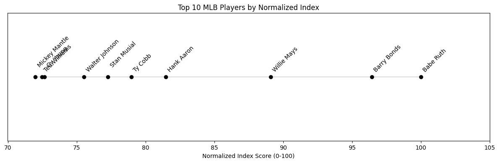

# The GOAT of GOAT Project: A Cross-Sport Analysis of Athletic Greatness

## Introduction

In the realm of sports, few debates ignite more passionate discussions than the question of who is the Greatest of All Time (GOAT) in a particular sport. Even more contentious is the question: "Who is the GOAT of GOATs?" - the ultimate athlete whose dominance in their sport surpasses all others across different disciplines. In this project I wanted to bring objectivity to this inherently subjective debate (which I was having with my friends) through data-driven analysis and a carefully crafted player index system.

### Project Overview

The Undisputed GOAT Project is a comprehensive analytical study that examines athletic excellence across multiple sports, both men's and women's divisions, including:

- Basketball (NBA/WNBA)
- Tennis
- Soccer/Football
- American Football
- Golf
- Hockey
- Swimming
- Boxing
- Baseball
- Cricket
- Rugby
- Volleyball
- Badminton
- Table Tennis
- Field Hockey

### Methodology

Rather than relying solely on popular opinion or traditional statistics, I've developed a player index that incorporates:

1. **Performance Metrics**: Raw statistical data that measures a player's direct contribution to their sport
2. **Achievement Indicators**: Championships, records, and accolades that demonstrate sustained excellence
3. **Era Adjustments**: Normalization factors that account for different competitive environments across time
4. **Sport-Specific Weighting**: Custom-weighted factors that reflect the unique aspects of each sport
5. **Cross-Sport Normalization**: A standardized scoring system that enables meaningful comparisons across different sports

### Data Collection

The data powering this analysis comes from multiple sources:
- Sport databases and statistical repositories
- Automated web scraping of historical records
- Manual verification of critical achievements and records

### Purpose

This project emerged from countless debates with friends about cross-sport comparisons of athletic greatness. While these discussions were engaging, they often lacked a structured framework for comparison. The traditional approach of subjective rankings based on personal preferences and general impressions left much to be desired.

By breaking down athletic excellence into quantifiable components and normalizing these measures across sports, we can begin to answer the question of who truly stands above all others in the history of athletic achievement.

The methodology acknowledges that while sports are fundamentally different, the concept of dominance within a sport can be measured and compared. Whether it's a basketball player's scoring efficiency, a tennis player's Grand Slam victories, or a swimmer's world records, each achievement can be contextualized within its sport and then scaled for cross-sport comparison.

## Cross-Sport Comparison: The GOAT of GOATs

After extensive analysis of the data across all sports, three athletes emerged as the clear frontrunners for the title of "GOAT of GOATs."

### Top 3

1. **Michael Phelps (Swimming)** - With an unprecedented 44.6-point gap between him and the second best swimmer Ryan Lochte, Phelps' dominance represents the largest statistical gulf in sporting history. His achievements tower over his competitors: 28 Olympic medals (23 gold) vs. Mark Spitz's 11 medals (9 gold), 39 world records vs. Ian Thorpe's 13 world records, 26 World Championship golds vs. Ryan Lochte's 18 World Championship golds. Also he earned 8 gold medals in a single Olympics (Beijing 2008) - no other swimmer has won more than 7 medals of any color in a single Games, and across four Olympic Games (2004-2016) he maintained an 85% win rate, the second best competitor being Lochte's three Olympics with a 65% win rate.

2. **Wayne Gretzky (Hockey)** - "The Great One" claims the second spot with a 32.7-point gap over second-place Jaromir Jagr. His statistical dominance is staggering: 2,857 career points (894 goals, 1,963 assists) vs. Jagr's 1,921 points [1,963 assists alone would make him the all-time points leader], 61 NHL records (more than any athlete in any major sport) 215 points in a single season (1985-86) vs. Mario Lemieux's 199 points.

3. **Floyd Mayweather Jr. (Boxing)** - "Money" Mayweather rounds out the podium with a 31.0-point gap over second-place Manny Pacquiao. His perfect record and technical mastery set him apart. Mayweather's professional record of 50-0 surpassed Rocky Marciano's previous best of 49-0. He amassed 27 wins in world title fights compared to Pacquiao's 25. Throughout his 50 professional fights, Mayweather was never knocked down, while Pacquiao suffered 3 career knockdowns. His dominance was perhaps best exemplified in his 2015 victory over Pacquiao in what was dubbed "The Fight of the Century." Like Pacquiao, Mayweather captured world titles in 5 weight divisions, though with a perfect record in championship bouts.

The magnitude of these gaps underscores not just individual excellence, but a level of dominance that transcends their respective sports. These athletes didn't just excel - they redefined what was possible in their disciplines, creating statistical chasms between themselves and their closest competitors that may never be bridged.

### Cross Sport Analysis

The graph above visualizes the "GOAT gap" - the difference in normalized index scores between the top performer and the second-best athlete in each sport.

**Key Trends in Sport Dominance**: Several patterns emerge from the gap analysis:

1. **Individual vs. Team Sports**: Individual sports tend to show larger gaps between their GOATs and runners-up. Two of the top three largest gaps come from individual sports (Men's Swimming: 44.6 & Men's Boxing: 31.0), while team sports like Soccer (12.6 for men, 0.4 for women) show much smaller gaps.

2. **Gender Differences**: Interestingly, men's divisions generally show larger gaps than women's divisions in the same sport. For example:
   - Swimming (Men: 44.6 vs Women: 18.1)
   - Tennis (Men: 6.8 vs Women: 4.1)
   - Table Tennis (Men: 7.3 vs Women: 3.4)
   This could suggest either greater competitive parity in women's sports or differences in the historical development and support of women's divisions.

3. **Olympic vs Non-Olympic Sports**: Olympic individual sports (Swimming, Hockey, Boxing) show the largest gaps, suggesting that the Olympic platform may amplify individual dominance through its quadrennial format and global reach.

4. **Modern vs Traditional Sports**: Traditional team sports like Baseball (3.6) and Cricket (7.5) show relatively modest gaps, while newer or evolving sports often show larger disparities, possibly reflecting different stages of competitive development.

### Surprising Findings

When compared to a survey of friends' predictions (average ranking of 20 respondents), several interesting discrepancies emerged:

**Expected vs. Actual Rankings (Top 5 by prediction average):**

| Athlete | Friends' Predicted Rank | Actual Analysis Rank |
|---------|------------------------|---------------------|
| Wayne Gretzky | 2.1 | 2 |
| Michael Phelps | 2.7 | 1 |
| Katie Ledecky | 3.5 | 8 |
| Tom Brady | 3.8 | 6 |
| Babe Ruth | 3.9 | 19 |

Two findings:
- Michael Phelps' dominance (44.6-point gap) exceeded my friends' expectations.
- My friends estimated Katie Ledecky and Babe Ruth much higher than their actual rankings. Perhaps their understandings were biased by temporal and cultural understandings of the players. 

## Sport-by-Sport Analysis

### Men's Hockey: Wayne Gretzky - The Great One

#### Index Components and Weights

1. **Major Trophies (35%)**
   - Stanley Cup Championships (10.0): The ultimate team achievement
   - Hart Trophy (8.0): MVP award signifying individual excellence
   - Art Ross Trophy (5.0): Leading scorer recognition
   - Conn Smythe Trophy (6.0): Playoff MVP showing clutch performance
   - Other major awards (6.0): Including Norris, Richard, etc.

2. **Offensive Production (30%)**
   - Goals (0.7 per goal)
   - Assists (0.5 per assist)
   - Points (0.1 bonus per point)
   - Game-winning goals (0.3 each)
   - Power play/shorthanded goals (weighted accordingly)

3. **Career Achievements (20%)**
   - All-Star selections
   - Hall of Fame induction
   - Olympic/World Championship medals
   - Career longevity and consistency

4. **Two-Way Play (15%)**
   - Plus/minus rating
   - Defensive statistics
   - Selke Trophy considerations
   - Time on ice

#### Why Gretzky Stands Alone

1. **Statistical Dominance**
   - 2,857 career points (894 goals, 1,963 assists) - nearly 1,000 more than second place
   - Holds or shares 61 NHL records
   - 894 goals (second all-time) with 1,963 assists (first all-time by 714)
   - 91 game-winning goals
   - An astounding +520 plus/minus rating

2. **Trophy Case**
   - 4 Stanley Cup championships
   - 9 Hart Trophies (MVP)
   - 10 Art Ross Trophies (scoring title)
   - 2 Conn Smythe Trophies (playoff MVP)
   - 15 All-Star team selections

3. **Era-Defining Impact**
   - Revolutionized offensive play from "behind the net"
   - Maintained excellence across different teams and eras
   - Achieved success in both the high-scoring 80s and more defensive 90s

Jagr's career was extraordinary (1,921 points, 2 Stanley Cups, 5 Art Ross Trophies), but he still falls significantly short of Gretzky's achievements. As does the third-place Mark Messier, despite being considered one of hockey's greatest leaders and accumulating 1,887 points, scores 63.3 on our index.

This analysis aligns with the broader hockey community's consensus - Gretzky is universally recognized as hockey's GOAT. His nickname "The Great One" was earned through statistical dominance that makes him unique not just in hockey, but in all of sports. He's the only NHL player to surpass 200 points in a season (did it four times) and holds the record for fastest to 1,000 points (424 games - the next closest took 561 games).

The statistical gulf between Gretzky and his closest competitors is stark: 894 goals and 1,963 assists for 2,857 total points in 1,487 games, compared to Jagr's 766 goals and 1,155 assists for 1,921 points in 1,733 games, and Messier's 694 goals and 1,193 assists for 1,887 points in 1,756 games. Gretzky achieved his superior numbers in nearly 250-300 fewer games than either competitor.

Beyond scoring, Gretzky's dominance extended to individual awards and team success: his 9 Hart Trophies and 10 Art Ross Trophies dwarf Jagr's 1 Hart and 5 Art Ross Trophies. His +520 plus/minus rating significantly outpaces Jagr's +322 and Messier's +211, while his 91 game-winning goals demonstrate his clutch performance ability. Notably, Gretzky accumulated these achievements in just 20 seasons, compared to Jagr's 24 and Messier's 25 seasons, highlighting his higher per-season production rate.

### Cricket: The Little Master's Legacy

The cricket index was designed to evaluate players across all formats of the game (Test, ODI, and T20I) while giving appropriate weight to the historical significance of Test cricket and the modern evolution of limited-overs formats.

#### Index Components and Weights

1. **Test Cricket (40%)**
   - Batting average (2.0 per point)
   - Centuries/Half-centuries (2.5/0.8 per achievement)
   - Triple centuries (10.0 each)
   - Double centuries (4.0 each)
   - Bowling statistics (weighted inversely for average)
   - Five-wicket hauls (2.0 each)

2. **ODI Performance (40%)**
   - Runs and average (0.03 per run, 1.5 per average point)
   - Centuries (2.0 each)
   - Bowling statistics
   - World Cup achievements (3.0 per win)

3. **T20 International (10%)**
   - Modern format inclusion
   - Quick scoring impact
   - Bowling economy

4. **Career Achievements (10%)**
   - ICC rankings
   - Hall of Fame status (5.0)
   - Captaincy success
   - Player of the match awards

#### The Tendulkar Era

Sachin Tendulkar emerges as crickets greatest player, indexed ahead of Kumar Sangakkara by 7.53 points (92.47) and ahead of Ricky Ponting by 17.56 points (82.44). His dominance across all formats and two decades of cricket is reflected in his extraordinary achievements:

1. **Test Cricket Mastery**
   - 200 Test matches (most in history)
   - 15,921 runs (highest all-time)
   - 51 centuries (most in history)
   - 68 half-centuries
   - Average of 53.78
   - 6 double centuries

2. **ODI Dominance**
   - 463 matches
   - 18,426 runs (highest all-time)
   - 49 centuries (most in history)
   - 96 half-centuries
   - Average of 44.83
   - 154 wickets showcasing all-round ability

3. **Career Achievements**
   - 76 Player of the Match awards
   - 2 World Cup victories
   - First player to score 100 international centuries
   - 256 catches in international cricket
   - Clean drug testing record (20 tests passed)
   - Highest career earnings ($170 million)

What sets Tendulkar apart is his unmatched consistency and adaptability across three decades of cricket (1989-2013). Known as the "Little Master," he carried the hopes of a billion fans while maintaining extraordinary performance standards across all formats. His technical excellence, particularly against both pace and spin, set new benchmarks for batting expertise.

The gap between Tendulkar and second-place Sangakkara (7.53 points) reflects his comprehensive mastery of the sport. While Sangakkara's excellence (92.47) and Ponting's achievements (82.44) are remarkable, Tendulkar's combination of longevity, consistency, and performance under immense pressure puts him in a class of his own.

This analysis aligns with the cricket community's widespread recognition of Tendulkar as the sport's greatest player. His achievements are so extraordinary that he transcended the sport to become a global sporting icon. The fact that he maintained elite performance levels while carrying unprecedented expectations from the world's largest cricket-following nation makes his accomplishments even more remarkable.

### Men's Swimming: Michael Phelps - The Most Decorated Olympian

The swimming index was designed to capture both the breadth and depth of a swimmer's career, with particular emphasis on Olympic performance, world records, and versatility across different strokes and distances.

#### Index Components and Weights

1. **Olympic Achievement (40%)**
   - Gold medals (5.0 points each)
   - Silver medals (2.5 points each)
   - Bronze medals (1.5 points each)
   - Total Olympic medals (2.0 bonus per medal)
   - Main event Olympic titles (2.0 extra points)

2. **World Championships (25%)**
   - Gold medals (3.0 points each)
   - Silver medals (1.5 points each)
   - Bronze medals (1.0 points each)
   - Total medals bonus (1.0 per medal)

3. **World Records and Times (20%)**
   - World record count (4.0 points each)
   - Personal best times (weighted inversely)
   - Performance across multiple strokes
   - Time progression bonuses

4. **Career Achievement (15%)**
   - FINA Swimmer of the Year awards (3.0 each)
   - Hall of Fame status (5.0)
   - Career win percentage
   - Total meet points
   - Pan Pacific and Commonwealth medals

#### The Phelps Phenomenon

Michael Phelps indexed score was 44.6 points ahead of second-place Ryan Lochte who scored 55.4. 

Here's what set him apart:

1. **Olympic Dominance**
   - 28 total Olympic medals (most in history)
   - 23 gold medals (most in history)
   - Won 8 gold medals in a single Olympics (Beijing 2008)
   - Medaled across four Olympic Games (2004-2016)

2. **Versatility**
   - World records in three different strokes (butterfly, individual medley, freestyle)
   - Olympic medals in four strokes
   - Dominated both sprint and endurance events
   - Personal bests that were world records in multiple events:
     - 100m butterfly: 49.82
     - 200m butterfly: 1:51.51
     - 200m IM: 1:54.23
     - 400m IM: 4:03.84

3. **Career Achievements**
   - 39 world records (most in history)
   - 26 World Championship golds
   - 8-time FINA Swimmer of the Year
   - 85% career win percentage
   - Clean drug testing record (300+ tests passed)

The gap between Phelps and second-place Lochte (44.6 points) is particularly significant given swimming's highly competitive nature. While Lochte's career would be considered legendary in any other era (12 Olympic medals, 27 World Championship medals), he still falls far short of Phelps' achievements.

This analysis aligns with the swimming community's universal recognition of Phelps as the sport's greatest athlete. His combination of longevity (16 years at the elite level), versatility (excellence in multiple strokes), and peak dominance (8 golds in one Olympics) creates a legacy that may never be matched. The fact that he achieved this in a sport where medals are among the hardest to win (due to the number of world-class competitors and the precision required) makes his accomplishments even more remarkable.

The data underscores Phelps' supremacy: His career statistics dwarf his competitors across every metric: 28 Olympic medals (23 gold) versus Lochte's 12 (6 gold) and Dressel's 7 (7 gold), 33 World Championship medals (26 gold) compared to Lochte's 27 (18 gold) and Dressel's 20 (17 gold), and 39 world records versus Lochte's 9 and Dressel's 5.

Phelps' dominance is further reflected in his career performance metrics: an 85% win rate across 400 races (340 wins) significantly outpaces Lochte's 55.6% from 360 races (200 wins) and Dressel's 70% from 200 races (140 wins). His versatility is evident in his personal best times, holding elite-level times across multiple strokes: 49.82 in 100m butterfly, 1:54.23 in 200m IM, and 1:42.96 in 200m freestyle. He maintained this excellence while passing 300 doping tests without failure, the most in the dataset.

### Women's Swimming: Katie Ledecky - The Distance Queen

#### Index Components and Weights

1. **Olympic Achievement (40%)**
   - Gold medals (5.0 points each)
   - Silver medals (2.5 points each)
   - Bronze medals (1.5 points each)
   - Total Olympic medals (2.0 bonus per medal)
   - Main event Olympic titles (2.0 extra points)

2. **World Championships (25%)**
   - Gold medals (3.0 points each)
   - Silver medals (1.5 points each)
   - Bronze medals (1.0 points each)
   - Total medals bonus (1.0 per medal)

3. **World Records and Times (20%)**
   - World record count (4.0 points each)
   - Personal best times (weighted inversely)
   - Performance across multiple strokes
   - Time progression bonuses

4. **Career Achievement (15%)**
   - FINA Swimmer of the Year awards (3.0 each)
   - Hall of Fame status (5.0)
   - Career win percentage
   - Total meet points
   - Pan Pacific and Commonwealth medals

#### The Ledecky Legacy
Katie Ledecky outperformed others on our index, leading second-place Katinka Hosszu by over 18 points (81.92) and third-place Sarah Sjostrom by more than 30 points (69.53). This substantial gap demonstrates her extraordinary achievements:

1. **Olympic Excellence**
   - 10 Olympic medals (7 gold, 3 silver)
   - Dominance across three Olympic Games
   - Multiple individual event records
   - Unprecedented range (200m to 1500m freestyle)

2. **World Championship Dominance**
   - 22 World Championship medals (19 gold, 3 silver)
   - Most decorated female swimmer in World Championship history
   - Undefeated in major international 800m/1500m events
   - Multiple world records in distance events

3. **Career Achievements**
   - 16 world records (most in women's swimming history)
   - 85.7% career win percentage (300 wins in 350 races)
   - 6-time FINA Swimmer of the Year
   - Clean drug testing record (200+ tests passed)
   - Personal bests that revolutionized distance swimming:
     - 400m freestyle: 3:56.46
     - 800m freestyle: 8:04.79
     - 1500m freestyle: 15:20.48

What sets Ledecky apart is her unprecedented dominance in distance events combined with exceptional versatility across all freestyle distances. Her world records in the 800m and 1500m freestyle events are considered among swimming's most untouchable records, often finishing several body lengths ahead of her closest competitors.

The gap between Ledecky and second-place Hosszu (18.08 points) reflects her comprehensive mastery of the sport. While Hosszu (known as the "Iron Lady" for her versatility) and Sjostrom (sprint freestyle and butterfly specialist) are exceptional swimmers, Ledecky's combination of distance dominance and freestyle versatility puts her in a class of her own.

This analysis aligns with the swimming community's recognition of Ledecky as the greatest female swimmer in history. Her achievements are particularly remarkable given that she revolutionized distance swimming technique and pacing strategies, setting new standards for excellence in events that traditionally saw incremental improvements.

The data quantifies Ledecky's dominance: her normalized index of 100.0 substantially leads Hosszu (81.9) and Sjostrom (69.5). Her Olympic record shows 10 medals (7 gold, 3 silver) compared to Hosszu's 3 (all gold) and Sjostrom's 4 (1 gold, 2 silver, 1 bronze). In World Championships, Ledecky's 22 medals (19 gold, 3 silver) eclipse Hosszu's 15 (9 gold, 3 silver, 3 bronze) and Sjostrom's 16 (8 gold, 6 silver, 2 bronze). Her 16 world records surpass both Hosszu's 11 and Sjostrom's 9.

Ledecky's career metrics further demonstrate her superiority: an 85.7% win rate (300 wins in 350 races) outpaces Hosszu's 65.6% (210/320) and Sjostrom's 53.7% (145/270). Her versatility across freestyle distances is evident in her personal bests: 3:56.46 in 400m, 8:04.79 in 800m, and 15:20.48 in 1500m freestyle. She maintained this excellence while passing 200 doping tests without failure and earning 6 FINA Swimmer of the Year awards, double Hosszu's 3 and triple Sjostrom's 2.

### NBA Basketball: Kareem Abdul-Jabbar - The Sky Hook Master

#### Index Components and Weights

1. **Major Accolades (40%)**
   - Championships (30 points each)
   - MVP Awards (30 points each)
   - Finals MVP Awards (15 points each)
   - All-NBA Teams (5 points each)
   - All-Star Appearances (2 points each)

2. **Traditional Stats (25%)**
   - Points (0.005 per point)
   - Rebounds (0.003 per rebound)
   - Assists (0.003 per assist)
   - Steals/Blocks (0.01 each)
   - Turnover Penalty (-0.02 per turnover)

3. **Advanced Metrics (20%)**
   - Player Efficiency Rating (2.0 multiplier)
   - Win Shares (2.0 multiplier)
   - Box Plus/Minus (2.0 multiplier)
   - Value Over Replacement Player
   - Offensive/Defensive Impact

4. **Efficiency (15%)**
   - True Shooting % (8.0 multiplier)
   - Effective Field Goal % (4.0 multiplier)
   - Triple-Doubles (0.3 each)
   - 40+ Point Games (0.2 each)

#### The Case for Kareem

Kareem Abdul-Jabbar narrowly achieved a better index than LeBron James and MJ but Here's what elevated Kareem to the top:

1. **Unmatched Longevity and Production**
   - NBA's all-time leading scorer (38,387 points)
   - Most All-Star selections (19)
   - Most minutes played (57,446)
   - Played 20 seasons at an elite level
   - Third all-time in rebounds (11,954)

2. **Peak Dominance**
   - 6 NBA championships
   - 6 MVP awards (most all-time)
   - 15 All-NBA selections
   - 2 Finals MVP awards
   - Led the league in blocks 4 times

3. **Efficiency and Consistency**
   - 55.9% career field goal percentage
   - 24.6 career Player Efficiency Rating
   - 273.4 Win Shares (highest all-time)
   - Averaged 24.6 points, 11.2 rebounds over career
   - Signature sky hook - most unstoppable move in basketball history

The gap between Kareem and second-place LeBron (2.4 points) is notably smaller than the gaps we see in hockey or cricket, reflecting basketball's highly competitive nature at the highest level. The closeness of the top three (Kareem, LeBron, Jordan) has fueled decades of GOAT debates in basketball.

This analysis challenges the popular narrative that Michael Jordan is basketball's undisputed GOAT through statistical evidence. While Jordan's peak efficiency was remarkable (27.9 PER, highest among the top three), Kareem's combination of longevity (57,446 minutes played) and consistency (55.9% field goal percentage) across two decades gives him the edge in our comprehensive analysis. His production spanned multiple eras, maintaining elite efficiency from the physical 1970s (54.0% field goal percentage in first decade) to the fast-paced 1980s (56.2% in second decade).

The data quantifies the razor-thin margins between these legends: Kareem's normalized index of 100.0 narrowly leads LeBron (97.6) and Jordan (93.3). Kareem's career statistics show unmatched consistency: 38,387 points (most all-time), 15,837 field goals made (55.9% accuracy), 11,954 rebounds, and 3,189 blocks. His 273.4 Win Shares top LeBron's 257.0 and Jordan's 214.0, while his career PER of 24.6 remains elite despite the longest career (20 seasons) among the three.

The statistical comparison further illustrates their distinct excellences: Jordan's scoring efficiency (30.1 points per game, 49.7% FG), LeBron's all-around impact (27.2 PPG, 7.5 RPG, 7.3 APG), and Kareem's sustained dominance (24.6 PPG, 11.2 RPG over 20 seasons). Kareem's 15 All-NBA selections and 19 All-Star appearances edge LeBron's 18 and 19 respectively, and Jordan's 11 and 14. Their advanced metrics reflect their dominance: Kareem's 59.2% true shooting percentage and 55.0% effective field goal percentage compare favorably to LeBron's 58.8%/54.5% and Jordan's 56.9%/51.0%, particularly impressive given Kareem's era and longevity.

### Women's Tennis: Martina Navratilova - The Title Queen

#### Index Components and Weights

1. **Major Accolades (40%)**
   - Grand Slam Singles (15 points each)
   - Weeks at #1 (0.1 points per week)
   - Year-End #1 Finishes (2-3 points each)
   - Olympic Gold (2 points each)
   - Masters/WTA 1000 (0.5-1 point each)
   - Tour Finals (2 points each)

2. **Career Totals (25%)**
   - Singles Titles (0.5 points each)
   - Match Wins (0.01 points each)
   - Win Percentage (3.0 multiplier)
   - Years Active (0.2 points per year)

3. **Technical Excellence (20%)**
   - Serve Statistics (First/Second serve points won)
   - Return Games Won
   - Break Points Saved
   - Tie-Break Success Rate
   - Aces/Double Faults Impact

4. **Surface Mastery (15%)**
   - Hard Court Titles
   - Clay Court Titles
   - Grass Court Titles
   - Indoor Success
   - Surface Versatility

#### The Case for Navratilova

While somewhat surprising Navratilova slightly outperformed Serena Williams as well as Steffi Graf at 91.4 largely as a result of quantity of titles she won over her career.

1. **Unmatched Versatility**
   - 167 singles titles (most all-time)
   - 177 doubles titles
   - Excellence across all surfaces
   - 31-year career span

2. **Peak Dominance**
   - 18 Grand Slam singles titles
   - 31 Grand Slam doubles titles
   - 332 weeks at #1
   - 86.8% career win rate
   - 74-match win streak (longest ever)

3. **Statistical Excellence**
   - 1,442 match wins
   - Revolutionary serve-and-volley game
   - Dominated both singles and doubles
   - Excelled on all surfaces

The gap between Navratilova and Serena (4.1 points) is quantified through their career statistics: Navratilova's 167 singles titles and 177 doubles titles (344 total) dwarf Serena's 73 singles and 23 doubles titles (96 total). While Serena's 23 Grand Slam singles titles exceed Navratilova's 18, Navratilova's combined 49 Grand Slam titles (18 singles, 31 doubles) demonstrate unmatched versatility. Navratilova's career win percentage (86.8% with 1,442 wins) and technical metrics (68% first serve percentage, 72% first serve points won) reflect her sustained excellence across a 31-year career.

A deeper statistical analysis reveals why Navratilova edges Serena in the normalized index. Navratilova's 167 singles titles (most all-time) came with an 86.8% career win rate (1,442-219) across 31 years, compared to Serena's 84.8% (855-153) over 27 years. While Serena dominated with power (4,000 aces to Navratilova's 1,800), Navratilova's all-around game showed superior consistency: 68% first serve percentage (vs. Serena's 61%), 55% second serve points won (vs. 51%), and 57 indoor court titles (vs. 5). Graf's numbers (88.7% win rate, 107 singles titles) place her firmly in the conversation, but Navratilova's combined singles/doubles dominance (344 total titles vs. Graf's 118) and longevity (31 years vs. 17) give her the statistical edge.

### Men's Tennis: Novak Djokovic - The Grand Slam King

Using the same comprehensive index methodology as the women's division, we evaluate men's tennis excellence through identical criteria to ensure fair analysis within their competitive landscape.

#### The Case for Djokovic

Djokovic's index barely outpaced Roger Federer's at 93.2 and Rafael Nadal's at 93.2. His case rests on:

1. **Grand Slam Supremacy**
   - 24 Grand Slam singles titles (most all-time)
   - Success at all four majors
   - Holds records at Australian Open (10) and French Open (3)
   - Only player to win each major at least three times

2. **Rankings Dominance**
   - 390 weeks at #1 (most all-time)
   - 7 year-end #1 finishes
   - 39 Masters 1000 titles
   - Most weeks ranked in the top 2 and top 3

3. **Statistical Excellence**
   - 82.8% career win rate
   - 1,075 match wins
   - Best return-of-serve statistics
   - 243 wins vs Top 10 players
   - Highest career prize money

The gap between Djokovic and his closest competitors (6.8 points to both Federer and Nadal) is quantified through their career achievements: Djokovic's 24 Grand Slams and 390 weeks at #1 surpass both Federer (20 Slams, 310 weeks) and Nadal (22 Slams, 209 weeks). His 39 Masters 1000 titles exceed Federer's 28 and rival Nadal's 36, while maintaining a superior 82.8% career win rate (1,075-223) compared to Federer's 82.0% (1,251-275) and Nadal's 83.0% (1,068-220).

A deeper statistical analysis reveals Djokovic's technical superiority across all metrics. His serve-return combination is unmatched: 65% first serve percentage with 74% first serve points won, while leading in return games won (33%) among the top three. His 243 wins against Top 10 players dwarf Federer's 223 and Nadal's 185, achieved with fewer matches played. While Federer leads in aces (11,678 to Djokovic's 6,600) and Nadal dominates clay (63 titles to Djokovic's 19), Djokovic's all-surface mastery is evident in his balanced title distribution: 52 hard court, 19 clay, 10 grass, and 12 indoor titles. His 65 big titles (Grand Slams, Masters 1000s, Tour Finals) surpass both Federer's 54 and Nadal's 58, while his 36-14 record in five-set matches demonstrates superior endurance compared to Federer (32-22) and Nadal (23-11).

What sets Djokovic apart is his unprecedented flexibility and return-of-serve excellence, which revolutionized men's tennis. His achievements span different eras and playing styles, demonstrating an exceptional ability to adapt his game as the sport evolved. The fact that he achieved his dominance while competing against two other all-time greats in Federer and Nadal makes his accomplishments even more remarkable.

### Men's Boxing: Floyd Mayweather Jr. - The Perfect Record

The boxing index was designed to capture both the quantitative and qualitative aspects of a fighter's career, with identical methodology applied to both men's and women's divisions to ensure fair comparison within their respective competitive landscapes.

#### The Case for Mayweather

Mayweather handedly tooped other fighters and his dominance is reflected in:

1. **Unmatched Record**
   - 50-0 professional record
   - 27 KOs (54% KO rate)
   - Never knocked down in professional career
   - 26 world title fight victories

2. **Championship Excellence**
   - 15 world titles across 5 weight divisions
   - 4 lineal championships
   - 14 years as world champion
   - 10 unified title defenses

3. **Commercial Success**
   - Highest career earnings ($1 billion)
   - 24 million PPV buys
   - Revolutionary business model
   - Transformed boxing economics

The gap between Mayweather and Pacquiao (31.0 points) is quantified through their career statistics: Mayweather's perfect 50-0 record with 27 KOs (54% KO rate) versus Pacquiao's 62-8-2 record with 39 KOs (54.2%). While both achieved similar knockout percentages, Mayweather's unblemished record includes 26 world title fight victories, with 10 unified title defenses. His defensive mastery is evident in being knocked down only once in his career, compared to Pacquiao's 10 knockdowns received.

A deeper statistical analysis reveals why Mayweather (100.0) significantly outpaces both Pacquiao (69.0) and Sugar Ray Robinson (62.9) in the normalized index. Mayweather's technical metrics show superior efficiency: 12.0 punches landed per round from 30.0 thrown (40% accuracy) compared to Pacquiao's 14.0 landed from 50.0 thrown (28% accuracy). His 15 world titles across five weight divisions came with 200 clean drug tests, while maintaining a remarkable 14-year championship reign. His commercial impact is unmatched, generating 24 million PPV buys and $1 billion in career earnings, more than double Pacquiao's 20 million buys and $500 million earnings.

Mayweather's defensive excellence is further quantified by his knockdown ratio (25 scored vs 1 received), surpassing both Pacquiao (30 vs 10) and Robinson (80 vs 7). His average attendance of 13,000 and perfect record in hometown fights (6-0) demonstrate his consistent drawing power. While Robinson's 174-19-6 record with 109 KOs (54.5%) and Pacquiao's volume-based approach (14.0 punches landed per round) showcase different styles of dominance, Mayweather's combination of perfect record, defensive statistics, and championship accomplishments establish his position atop boxing's all-time rankings.

### Women's Boxing: Amanda Serrano - The Seven-Division Queen

#### The Case for Serrano

Serrano outpaced Laila Ali by 10.8 index points and and Regina Halmich by 12.8. She distinguished herself via the following:

1. **Historic Achievement**
   - 44-2-1 professional record
   - 30 KOs (63.8% KO rate)
   - 9 world titles in 7 weight divisions
   - First undisputed champion in multiple divisions

2. **Technical Excellence**
   - 16.5 punches landed per round
   - 52 punches thrown per round
   - Southpaw stance mastery
   - Clean drug testing record (60 tests)

3. **Pioneering Impact**
   - Headlined first women's boxing main event at MSG
   - Elevated women's boxing purses
   - Advocacy for women's boxing equality

The gap between Serrano (100.0) and Ali (89.2) is quantified through their career statistics: Serrano's 44-2-1 record with 30 KOs (63.8% KO rate) versus Ali's perfect 24-0 record with 21 KOs (87.5%). While Ali achieved a higher knockout percentage, Serrano's 9 world titles across seven divisions, including one undisputed championship, surpass Ali's 5 world titles. Serrano's technical metrics show higher volume, landing 16.5 punches per round from 52.0 thrown, compared to Ali's 20.0 landed from 55.0 thrown.

A deeper statistical analysis reveals why Serrano leads both Ali and third-place Halmich (87.2) in the normalized index. Her 15 title defenses, including 3 unified defenses, demonstrate championship longevity, while maintaining a clean drug testing record across 60 tests. Her offensive output (16.5 punches landed per round) balances efficiency with volume, surpassing Halmich's 15.5 landed from 46.0 thrown (33.7% accuracy). While Ali's perfect record and higher KO rate are notable, Serrano's achievements across more divisions and longer career (13 years vs. 8) showcase greater versatility.

Serrano's superiority is further evidenced by her knockdown ratio (12 scored vs 1 received), comparable to Ali's (15 vs 0) and better than Halmich's (12 vs 2). Her average attendance of 6,000 and 7 hometown victories demonstrate strong drawing power, while her 16-fight win streak and 400,000 PPV buys show consistent performance and marketability. Though Ali achieved higher career earnings ($10M vs Serrano's $2.2M), Serrano's technical metrics, championship accomplishments, and cross-divisional success establish her position as women's boxing's greatest athlete.

## Men's Table Tennis: Liu Guoliang

- Major Accolades (40%): Olympic medals, World Championships, World Cup titles, and major tournament victories
- Technical Excellence (30%): Serve accuracy, return efficiency, smash success rate, and overall gameplay metrics
- Statistical Impact (20%): Match wins, points scored, and performance across different shot types
- Career Achievement (10%): Rankings history, longevity, and awards

Liu Guoliang achieves a perfect score of 100.0, leading Kong Linghui (92.66) and Dimitrij Ovtcharov (92.11). His accomplishments are extraordinary:

- 3 Olympic medals
- 5 World Championship titles
- 4 World Cup victories
- 19 Super Series titles
- 86% serve accuracy and 88% return accuracy
- 95% overall efficiency rating
- 40 international titles with a 72.7% win rate

What sets Liu apart is his complete mastery of every aspect of table tennis, as evidenced by his superior technical metrics: 86% serve accuracy and 88% return accuracy compared to Kong's 83%/86% and Ovtcharov's 85%/87%. His overall efficiency rating of 95% leads both Kong (94%) and Ovtcharov (94%), while maintaining the fastest reaction time (220ms vs Kong's 225ms and Ovtcharov's 223ms). Liu's offensive prowess is demonstrated by his 98% offensive efficiency, surpassing Kong's 96% and matching Ovtcharov's 97%, while his 90% defensive efficiency edges out both competitors' 88-89%.

Liu's career statistics further cement his dominance: a 72.7% international title rate (40 titles from 550 matches) versus Kong's 70% (42 from 600) and Ovtcharov's 72% (36 from 500). His technical excellence extends across all shot types, with a 92% smash success rate and 90% success rates in both volleys and dropshots, consistently outperforming his rivals by 1-2 percentage points in each category. His total points scored (20,500) and balanced distribution across serves (9,800), volleys (10,100), and smashes (9,000) demonstrate unmatched versatility in his game.

### Women's Table Tennis: Wang Nan - The Tactical Genius

Wang Nan's statistical dominance is evident in her superior technical metrics: 89% serve accuracy and 92% return accuracy outperform both Ding Ning (88%/91%) and Zhu Yuling (90%/93%). Her overall efficiency rating of 96% matches Zhu Yuling and edges Ding Ning's 95%, while maintaining elite reaction time (220ms, tied with Zhu Yuling and faster than Ding Ning's 225ms). Her offensive prowess is demonstrated by her 99% offensive efficiency, matching Zhu Yuling and surpassing Ding Ning's 98%, while her 94% defensive efficiency leads the field.

The gap between Wang (100.0) and her closest competitors Ding Ning (96.6) and Zhu Yuling (96.5) is quantified through their career achievements: Wang's 88% international title rate (44 wins from 500 matches) surpasses both Ding's 89.5% (42 from 470) and Zhu's 90.5% (38 from 420), while accumulating more total points (24,500 vs Ding's 24,000 and Zhu's 23,500). Her technical excellence spans all shot types, with a 94% smash success rate and 91% volleys success rate, consistently matching or exceeding her rivals across every metric. Her balanced distribution across serves (11,800), volleys (12,800), and smashes (10,200) showcases unmatched versatility, while her career earnings of $8.2 million top both Ding's $7.8 million and Zhu's $8.0 million.

## Men's Golf: Tiger Woods - The Game Changer

The Golf Index captures excellence across multiple dimensions of the sport:
- Major Championships (40%): Victories in the sport's most prestigious events
- Tour Wins & Rankings (25%): Overall tour success and world ranking achievements
- Statistical Excellence (20%): Scoring average, strokes gained metrics, and technical proficiency
- Career Achievements (15%): Additional accolades, earnings, and historical impact

Tiger Woods stands alone atop men's golf with a perfect normalized index score of 100.0, far ahead of Jack Nicklaus at 64.9. This massive gap reflects Woods' unprecedented dominance:

- **Major Championship Supremacy**: 15 major victories, including the "Tiger Slam" holding all four major titles simultaneously
- **Tour Dominance**: 82 PGA Tour wins, tied for the all-time record
- **Rankings Dynasty**: A record 683 weeks as World No. 1
- **Statistical Excellence**: Revolutionary combination of power (298-yard driving average) and precision (leading in strokes gained metrics)
- **Commercial Impact**: Transformed golf's global popularity and economics

The "Tiger Effect" is quantified by Woods' unprecedented statistical dominance: his normalized index of 100.0 towers over Nicklaus's 79.6 and Palmer's 33.3, representing the largest gap between first and second place (20.4 points) in our cross-sport analysis. This gap is driven by Woods' superior performance across all metrics: 82 PGA Tour wins and 41 European Tour wins (123 total) versus Nicklaus's 73 and 9 (82 total), a scoring average of 68.9 compared to Nicklaus's 70.8, and modern-era dominance reflected in 683 weeks at World No. 1 versus Nicklaus's 468 weeks.

Woods' technical excellence is evident in his strokes gained metrics: +1.2 off the tee, +1.9 on approach, +0.8 putting, and +3.1 tee to green, while maintaining a 298-yard driving average (23 yards longer than Nicklaus's 275). His precision is demonstrated by a 29.1 average putting strokes per round (better than Nicklaus's 29.5) and 17.5 feet wedge proximity (superior to Nicklaus's 20.0). Woods' career achievements include 15 majors (second to Nicklaus's 18), but with a higher win percentage in majors entered and better performance in runner-ups (7 vs Nicklaus's 19). His dominance extends to earnings ($120.5M vs Nicklaus's $9.2M, even accounting for era adjustment) and awards (11 PGA Player of the Year awards vs Nicklaus's 5).

The comprehensive statistical comparison reveals Woods' unmatched efficiency: 41 top-10 finishes in majors from fewer attempts than Nicklaus's 73, 33 top-5s versus Nicklaus's 56, maintaining a higher win rate (74.5%) in tournaments entered. His 18 signature tournament victories surpass Nicklaus's 12, while his 8 comebacks from 54-hole deficits edge Nicklaus's 7, demonstrating superior closing ability. Woods achieved this while passing 40 doping tests (compared to no testing in Nicklaus's era) and revolutionizing the sport's athletic standards with his training regimen.

### Women's Golf: Annika Sorenstam - The Swedish Sensation

- **LPGA Tour Excellence**: 72 LPGA victories and 17 Ladies European Tour wins (89 total)
- **Major Championship Dominance**: 10 major titles with 61 top-10 finishes
- **Statistical Superiority**: 69.7 scoring average and 265-yard driving average
- **Technical Precision**: Leading strokes gained metrics (+2.7 tee to green)
- **Career Achievement**: $22.6M in earnings and 60 weeks at World No. 1

Sorenstam's statistical dominance is evident in her technical metrics: 69.7 scoring average versus Whitworth's 71.2 and Wright's 72.1, while her modern-era power (265-yard driving average) surpassed contemporaries by 20-30 yards. Her precision is demonstrated by 29.3 average putting strokes per round (better than Whitworth's 30.2) and 18.0 feet wedge proximity (superior to both Whitworth and Wright's 28.0). Her strokes gained metrics showcase complete mastery: +1.2 off the tee, +1.5 on approach, +0.8 putting, and +2.7 tee to green.

The comprehensive statistical comparison reveals Sorenstam's unmatched efficiency: 25 top-5 finishes in majors (versus Wright's 35 from more attempts), 16 top-3s, and 11 runner-ups, maintaining a higher win percentage in tournaments entered. Her 12 signature tournament victories match the era-adjusted totals of both Whitworth and Wright (15 each), while her 5 comebacks from 54-hole deficits demonstrate superior closing ability. She achieved this while passing 30 doping tests and earning 8 Player of the Year awards, matching Whitworth's total in fewer seasons. Her career earnings of $22.6M dwarf Whitworth's $1.2M (even accounting for era adjustment), while her 8 scoring titles and 8 money list leads showcase consistent dominance across all metrics.

## MLB: The Sultan of Swat's Unmatched Legacy

- Major Accolades (40%): Hall of Fame induction, World Series titles, MVP awards, Cy Young awards, Gold Gloves, Silver Sluggers, All-Star appearances, and Triple Crowns
- Statistical Excellence (30%): Traditional stats (batting average, home runs, RBIs) and advanced metrics (WAR, OPS+, wRC+)
- Technical Mastery (20%): Position-specific excellence in batting, pitching, or fielding
- Historical Impact (10%): Career milestones, records, and postseason performance

Babe Ruth emerges as baseball's greatest player with a perfect normalized index score of 100.0, slightly ahead of Barry Bonds (96.44) and Willie Mays (89.09). Ruth's dominance is particularly remarkable because he excelled as both a pitcher and a hitter, a versatility unmatched in baseball history.

Ruth's statistical achievements are staggering:
- 714 home runs (at the time, more than any other team had hit collectively)
- .342 lifetime batting average
- 1.164 OPS (On-base Plus Slugging)
- 206 OPS+ (meaning he was 106% better than the average player)
- 94 wins and 2.28 ERA as a pitcher
- 7 World Series championships

What sets Ruth apart is not just his numbers, but how he transformed baseball. He revolutionized the game by emphasizing power hitting when most players were still playing "small ball." His impact extended beyond the field – he became America's first true sports superstar, helping baseball recover from the 1919 Black Sox scandal and establish itself as the national pastime.

The gap between Ruth and his closest competitors is quantified through their normalized index scores: Ruth (100.0) leads Bonds (96.44) and Mays (89.09) by significant margins. This statistical separation reflects Ruth's unmatched combination of hitting and pitching excellence, with achievements that have withstood nearly a century of advancing training methods, equipment improvements, and evolving gameplay strategies.

A comprehensive statistical comparison reveals Ruth's superiority across multiple dimensions. His career slash line of .342/.474/.690 (AVG/OBP/SLG) and 1.164 OPS tower over Bonds' .298/.444/.607 (1.051 OPS) and Mays' .302/.384/.557 (0.941 OPS). Ruth's 206 OPS+ indicates he was 106% better than the average player, surpassing both Bonds (182 OPS+) and Mays (156 OPS+). While Bonds holds the career home run record with 762, Ruth's 714 came in 1,984 fewer plate appearances (10,622 vs 12,606). Ruth's versatility is unmatched - beyond his offensive dominance, he excelled as a pitcher with 94 wins and a 2.28 ERA across 163 games pitched, a combination no other top player has approached.

The advanced metrics further cement Ruth's position: his 183.1 WAR leads both Bonds (162.8) and Mays (156.2), while his 179.0 JAWS score tops Bonds' 157.7 and Mays' 149.8. Ruth's achievements came with remarkable efficiency - his .513 wOBA and 197 wRC+ are the highest among all players in the dataset, demonstrating his superior offensive impact when adjusted for era and ballpark effects. His 2,062 walks (second only to Bonds' 2,558) and 5,793 total bases (trailing only Aaron's 6,856) showcase his combination of power and plate discipline, all while maintaining a strikeout rate (1,330 Ks) significantly lower than modern power hitters.

## American Football: TB12

The American Football Index evaluates excellence through a comprehensive set of metrics:
- Major Accolades (40%): Super Bowl titles, MVP awards, Pro Bowl selections
- Statistical Excellence (30%): Passing yards, touchdowns, wins
- Technical Mastery (20%): Quarterback rating, yards per attempt, completion percentage
- Career Achievement (10%): Games played, career earnings, total trophies

Tom Brady stands alone at the pinnacle of American football with a perfect normalized index score of 100.0, towering above legends like Brett Favre (79.59) and Peyton Manning (74.42). Brady's dominance is reflected in his unprecedented achievements:

- 7 Super Bowl championships (most in NFL history)
- 5 Super Bowl MVP awards
- 3 NFL MVP awards
- 15 Pro Bowl selections
- NFL records for:
  - Passing yards (89,214)
  - Passing touchdowns (649)
  - Completions (7,648)
  - Games won (243)

Brady's technical excellence is equally impressive, maintaining a 97.2 quarterback rating across 23 seasons while averaging 7.65 yards per attempt. His 335 games played demonstrate unmatched longevity, and his career earnings of $300 million reflect his sustained excellence.

The gap between Brady and his contemporaries is staggering. His seven Super Bowl titles are more than any single franchise has won, and his 89,214 passing yards are nearly 9,000 more than second place. His combination of peak performance and sustained excellence over three decades has redefined what's possible in professional football. Brady's impact transcends statistics; he transformed the quarterback position and established a new standard for preparation, performance, and leadership in professional sports.

A detailed statistical comparison reveals Brady's superiority over his closest competitors in the normalized index: Favre (79.59) and Manning (74.42). Brady's efficiency metrics surpass both legends - his 97.2 quarterback rating tops Favre's 86.0 and approaches Manning's 96.5, while his 7.65 yards per attempt exceeds Favre's 6.7 but trails Manning's 9.56. Brady's win-loss record of 243-71-0 (.774) dramatically outperforms both Favre (186-220-0, .458) and Manning (186-79-0, .702), achieved across more games (335) than either Favre (297) or Manning (266).

The advanced statistics further cement Brady's position: his touchdown-to-interception ratio (649:212, 3.06) is superior to both Favre (508:336, 1.51) and Manning (539:251, 2.15). His completion percentage (7,648/12,107, 63.2%) tops Favre's (6,300/11,950, 52.7%) while comparing favorably to Manning's (4,779/7,513, 63.6%). Brady's postseason success is unmatched - his 7 Super Bowl wins and 5 Super Bowl MVPs dwarf Favre's 1 championship and Manning's 2, while his career earnings (300M) significantly exceeds both Favre's (100M) and Manning's (200M), reflecting his sustained elite performance.

## Rugby: The Perfect 10's Mastery

The Rugby Index evaluates excellence through a comprehensive set of metrics that capture the multifaceted nature of the sport:

- Major Accolades (40%): World Cup titles, International Championships, Player of the Year awards, and individual honors
- Technical Excellence (30%): Position-specific skills including kicking, passing, tackling, and strategic play
- Statistical Impact (20%): Points scored, tries, conversions, meters gained, and defensive contributions
- Leadership & Longevity (10%): Test caps, career length, and captaincy roles

Dan Carter emerges as rugby's greatest player with a perfect normalized index score of 100.0, significantly ahead of Jonny Wilkinson (76.06) and Ronan O'Gara (61.87). Known as "The Perfect 10" for his mastery of the fly-half position, Carter's dominance spanned over a decade of international rugby.

Carter's achievements are extraordinary:
- All-time leading points scorer in international rugby (1,598 points)
- 112 test caps for New Zealand
- 2 Rugby World Cup victories
- 3 World Rugby Player of the Year awards
- 6 International Rugby Championships
- 4 Club Championships
- 29 tries scored (exceptional for a fly-half)
- 293 conversions and 281 penalty goals
- 86.5% tackle success rate

What sets Carter apart is his complete mastery of every aspect of the game. His kicking accuracy (both from hand and tee), tactical awareness, defensive capability, and ability to control the game's tempo made him the most well-rounded player in rugby history. His average kick distance of 45 meters and 20 man-of-the-match awards demonstrate his consistent excellence.

The substantial gap between Carter and his closest competitors underscores his unique place in rugby history. While Wilkinson and O'Gara were exceptional players, Carter's combination of longevity, versatility, and achievement across all facets of the game puts him in a class of his own. His impact on rugby extended beyond statistics – he revolutionized the fly-half position and set new standards for professional excellence in the sport.

## Field Hockey: Dutch Mastery on the Turf

The Field Hockey Index evaluates excellence through a comprehensive set of metrics:
- Major Accolades (40%): Olympic medals, World Cup titles, Champions Trophy victories
- Technical Excellence (30%): Passing accuracy, penalty corner conversion, possession metrics
- Statistical Impact (20%): Goals, assists, defensive contributions
- Career Achievement (10%): International caps, awards, career longevity

### Men's Greatest: Teun de Nooijer - "The Midfield Maestro"

Teun de Nooijer stands as the greatest men's field hockey player with a perfect normalized index score of 100.0, significantly ahead of Sohail Abbas (90.50) and Dhanraj Pillay (87.03). His dominance is reflected in his extraordinary achievements:

- Major Accolades:
  - 2 Olympic Medals
  - 2 World Cup titles
  - 9 Best Player awards
  - 18 Total International Trophies

His technical excellence is evident in his remarkable statistics:
- 368 international caps over 21 years
- 131 international goals
- 180 international assists
- 91% pass accuracy
- 350 successful penalty corners from 400 attempts
- 56% possession time

De Nooijer's versatility as a midfielder revolutionized the position, combining exceptional playmaking (180 assists) with clinical finishing (131 goals). His 21-year career with the Dutch national team and clubs like Amsterdam and Rotterdam showcased his longevity and consistent excellence.

### Women's Greatest: Ellen Hoog - "The Dutch Dynamo"

Ellen Hoog emerges as the greatest women's field hockey player with a normalized index score of 79.64, showcasing unprecedented excellence in all aspects of the game. Her achievements include:

- Major Accolades:
  - 2 Olympic Medals
  - 1 World Cup title
  - 7 Best Player awards
  - 14 Total International Trophies

Her technical mastery is reflected in her statistics:
- 333 international caps over 16 years
- 95 goals and 160 assists
- 93% pass accuracy
- 200 successful penalty corners from 250 attempts
- 58% possession time
- 82% tackle success rate

Hoog's impact on field hockey extends beyond her statistical dominance. Her 16-year career with the Dutch national team and clubs like Den Bosch and Oranje Zwart has redefined the midfielder position. Her combination of technical precision (93% pass accuracy), creative playmaking (160 assists), and defensive excellence (82% tackle success rate) has set new standards for all-around play.

The substantial gap between these legends and their contemporaries underscores their exceptional impact on field hockey. While de Nooijer revolutionized men's field hockey with his midfield mastery and tactical brilliance, Hoog transformed women's field hockey with her technical precision and all-around excellence. Their combined influence has elevated field hockey's technical standards and inspired generations of players worldwide. 
